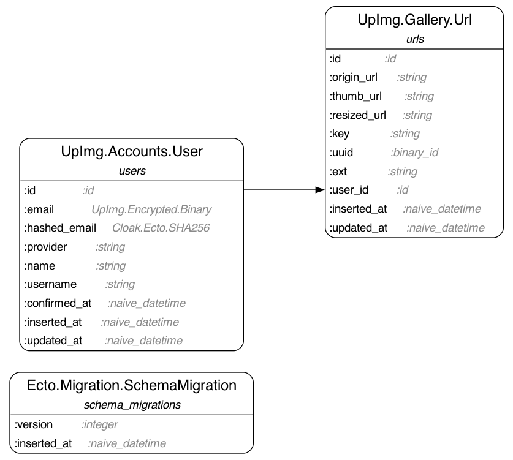

# UpImg

## Generate the Database migration schema

```bash
mix ecto.gen.erd
dot -Tpng ecto_erd.dot > erd.png
```



## Notes for dev mode

To stop rebuild when file changes, remove the folder "image_uploads" from the watched list by setting:

```elixir
# /config/dev.exs
config :up_img, UpImgWeb.Endpoint,
  live_reload: [
    patterns: [
      ~r"priv/static/[^image_uploads].*(js|css|png|jpeg|jpg|gif|svg)$",
      ~r"priv/gettext/.*(po)$",
      ~r"lib/up_img_web/(controllers|live|components)/.*(ex|heex)$"
    ]
  ]
```

About configuration. To properly configure the app (with Google & Github & AWS credentials):

- set the env variables in ".env" (and run `source .env`),
- set up a keyword list with eg `config :my_app, :google, client_id: System.get_env(...)` in "/config/dev.exs" and "/config/runtime.exs".
- in the app, you then can call `Application.fetch_env!(:my_app, :google)|> Keyword.get(:client_id)`
- you can also use the helper `MyApp.config([main_key, secondary_key])`. It should raise if the runtime time is missing.

If you don't have a nested keyword list, a simple helper can be:

```elixir
#my_app.ex
def config([first, second]) do
  case Application.get_application(__MODULE__)
        |> Application.fetch_env!(first)
        |> Keyword.get(second) do
    nil -> raise "No config found for: #{first}, #{second}"
    res -> res
  end
end
```

To serve some SVGs located in "/priv/static/images" (as ``) instead of polluting the HTML markup, you can add the SVG file in the "/priv/static/images" directory and append the static list that Phoenix will server:

```elixir
#my_app_web.ex
 def static_paths, do:
 ~w(assets fonts images favicon.ico robots.txt image_uploads)
```

To handle failed task in `Task.async_stream`, use `on_timeout: :kill_task` so that a failed task will send `{:exit, :timeout}`.

About the **reset of Uploads**.
One solution is to "reduce" while `cancel_upload` all the refs, then reset the "uploaded_files_locally".

In the HTML, when the template is updated, we check for the errors, and if any, send a message to firstly display it, and then reset the upload and reset the uploaded list. The user will have a fresh form.

```elixir
def are_files_uploadable?(image_list) do
  error_list = Map.get(image_list, :errors)

  case Enum.empty?(error_list) do
    true ->
      true

    false ->
      send(self(), {:upload_error, error_list})
      false
  end
end
```

```elixir
def handle_info({:upload_error, error_list}, socket) do
  errors =
    error_list |> Enum.reduce([], fn {_ref, msg}, list -> [error_to_string(msg) | list] end)

  send(self(), {:cancel_upload})
  {:noreply, put_flash(socket, :error, inspect(errors))}
end
```

and then:

```elixir
def handle_info({:cancel_upload}, socket) do
  # clean the uploads
  socket =
    socket.assigns.uploads.image_list.entries
    |> Enum.map(& &1.ref)
    |> Enum.reduce(socket, fn ref, socket -> cancel_upload(socket, :image_list, ref) end)

  {:noreply, assign(socket, :uploaded_files_locally, [])}
end
```
